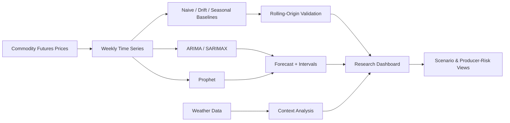

# Commodity Forecasting Research Lab

[](requirements.txt)
[](app.py)
[](src/validation.py)
[](src/forecaster.py)
[](https://github.com/ParBproject/commodity-price-forecaster/actions/workflows/python-package-conda.yml)

A decision-oriented time-series forecasting project for **energy, metals, and agricultural commodities** using real market prices, statistical forecasting, rolling-origin benchmark validation, uncertainty intervals, weather context, decomposition, and scenario analysis.

The project is designed to demonstrate both **Quantitative Specialist** and **Data Analyst** skills: time-series modeling, benchmark design, out-of-sample evaluation, external-data integration, risk communication, visualization, and reproducible testing.

## Employer snapshot

| Capability | Evidence |
|---|---|
| Real financial data | Commodity futures histories via Yahoo Finance |
| Forecasting | Auto-ARIMA / SARIMAX and Prophet |
| Baselines | Last-value, drift, and seasonal-naïve forecasts |
| Validation | Rolling-origin one-step evaluation with no future leakage |
| Forecast metrics | MAE, RMSE, MAPE, sMAPE, MASE, directional accuracy |
| Seasonality | Weekly resampling and STL decomposition |
| External context | Open-Meteo weather data for producing regions |
| Scenario analysis | Explicit supply, demand, and weather multipliers |
| Risk communication | Uncertainty intervals and producer-risk views |
| Engineering | Modular Python, tests, CI on Python 3.10/3.12 |
| Reporting | Professional Streamlit research dashboard |

## Research question

The project is not framed as “which model produces the prettiest future line?”

It asks:

1. What is the historical behavior of the commodity?
2. What trend and seasonal structure is visible?
3. How does a sophisticated model compare with **transparent naïve baselines**?
4. How stable is forecast error across rolling future observations?
5. How large is forecast uncertainty?
6. How should weather or supply/demand assumptions be presented without confusing scenario sensitivity with causality?

## Forecasting workflow

### Forecasting architecture




```text
Historical commodity futures prices
        ↓
Weekly resampling
        ↓
Trend / return / volatility analysis
        ↓
Rolling-origin baseline validation
        ↓
ARIMA / Prophet estimation
        ↓
Forecast + uncertainty interval
        ↓
Benchmark interpretation
        ↓
Weather context + decomposition
        ↓
Scenario sensitivity + producer risk
```

## Rolling-origin benchmark validation

A complex forecasting model should clear a simple benchmark before its results are treated as meaningful.

The new validation layer in `src/validation.py` evaluates three baselines:

**Last Value**

```text
Forecast[t+1] = Actual[t]
```

**Drift**

Extends the average historical movement between the first and latest training observation.

**Seasonal Naïve**

Repeats the observation from the prior seasonal cycle when enough history exists. For weekly commodity data, the default seasonal cycle is **52 weeks**.

For each rolling forecast origin, only observations strictly before the forecast date are available to the benchmark.

## Forecast metrics

The benchmark leaderboard reports:

- **MAE** — average absolute error in commodity-price units;
- **RMSE** — penalizes larger forecast misses;
- **MAPE** — percentage error where actual prices are non-zero;
- **sMAPE** — symmetric percentage error;
- **MASE** — error scaled by the in-sample one-step naïve error;
- **Directional Accuracy** — whether the predicted and realized weekly moves share the same sign.

A particularly useful interpretation is:

```text
MASE < 1 → better than the in-sample naïve error scale
MASE > 1 → worse than the naïve error scale
```

## Professional dashboard

The Streamlit application is organized into six workbenches:

**Market Overview**  
Price history, returns, volatility, range, and descriptive statistics.

**Forecast**  
ARIMA, Prophet, or ensemble forecasts with confidence intervals and exportable values.

**Forecast Validation**  
Rolling-origin baseline leaderboard, prediction traces, MASE, RMSE, and directional accuracy.

**Weather Context**  
Regional weather overlays and weather-price correlation diagnostics.

**Decomposition**  
Trend and seasonal structure through STL decomposition.

**Risk Dashboard**  
Producer/supplier risk scoring and scenario-oriented interpretation.

## Dashboard preview

### Market overview


### Forecast comparison


### Weather context


### Decomposition


### Risk dashboard


The current application includes an additional rolling-origin validation workbench and updated professional styling; screenshots should be regenerated after deployment to reflect the latest interface.

## Supported markets

| Category | Examples |
|---|---|
| Energy | WTI crude oil, Brent crude, natural gas |
| Metals | Gold, silver, copper |
| Agriculture | Corn, wheat, soybeans |

## Weather integration

Weather data is obtained through the Open-Meteo historical API for selected producing regions.

The application can contextualize price history with variables including:

- average temperature;
- precipitation;
- maximum wind speed;
- evapotranspiration.

Weather-price correlation is presented as descriptive context. It is **not** presented as proof of causality.

## Scenario analysis

The dashboard exposes explicit controls for:

- supply shock;
- demand shock;
- weather-impact multiplier.

These are sensitivity-analysis assumptions rather than estimated event probabilities.

Keeping scenario assumptions visible prevents the output from appearing more certain than the underlying model.

## Repository architecture

```text
commodity-price-forecaster/
├── app.py
├── src/
│   ├── data_loader.py
│   ├── forecaster.py
│   ├── validation.py
│   └── utils.py
├── tests/
│   ├── test_forecaster.py
│   └── test_validation.py
├── notebooks/
│   └── 01_model_development.ipynb
├── assets/screenshots/
├── .streamlit/config.toml
├── .github/workflows/
├── FORECASTING_METHODOLOGY.md
├── requirements.txt
└── README.md
```

## Run locally

```bash
git clone https://github.com/ParBproject/commodity-price-forecaster.git
cd commodity-price-forecaster

python -m venv .venv
source .venv/bin/activate

python -m pip install -r requirements.txt
streamlit run app.py
```

Run tests:

```bash
python -m pytest -q
```

## Validation and reproducibility

Automated tests cover:

- forecast metric calculations;
- empty and mismatched inputs;
- Prophet component handling when seasonalities are disabled;
- last-value benchmark behavior;
- drift forecasts using only training endpoints;
- seasonal-naïve cycle alignment;
- MASE scaling;
- rolling-origin chronology;
- bounded directional accuracy.

GitHub Actions runs linting, source compilation, the regression suite, and validation-module import checks on Python **3.10 and 3.12**.

## Skills demonstrated

**Time-series analytics:** ARIMA/SARIMAX, Prophet, decomposition, seasonality, rolling-origin validation.

**Data analysis:** pandas, NumPy, descriptive statistics, error metrics, weather integration, correlation analysis.

**Forecast governance:** benchmark comparison, uncertainty communication, MASE, chronological evaluation, explicit scenario assumptions.

**Software engineering:** modular Python, automated tests, CI/CD, cached external data, defensive validation.

**Business communication:** dashboard design, forecast tables, uncertainty intervals, scenario summaries, producer-risk interpretation.

## Methodology

See **[FORECASTING_METHODOLOGY.md](FORECASTING_METHODOLOGY.md)** for benchmark definitions, evaluation metrics, rolling-origin design, model assumptions, and production limitations.

## Limitations

- Commodity futures can contain contract-roll effects.
- Historical relationships can change across market regimes.
- Forecast intervals depend on model assumptions and data quality.
- Weather relevance differs by commodity and region.
- Correlation is not causation.
- Scenario multipliers are sensitivity assumptions, not estimated event probabilities.
- Repeated tuning against a fixed holdout can overfit the evaluation process.

## Roadmap

- rolling-origin evaluation for each fitted ARIMA / Prophet candidate;
- forecast calibration and interval-coverage diagnostics;
- inventory, term-structure, FX, rates, and production fundamentals;
- downloadable validation reports;
- hosted dashboard deployment.

## Responsible use

Educational forecasting and analytics project only. Forecasts and scenarios are uncertain and do not constitute trading, hedging, or investment advice.
