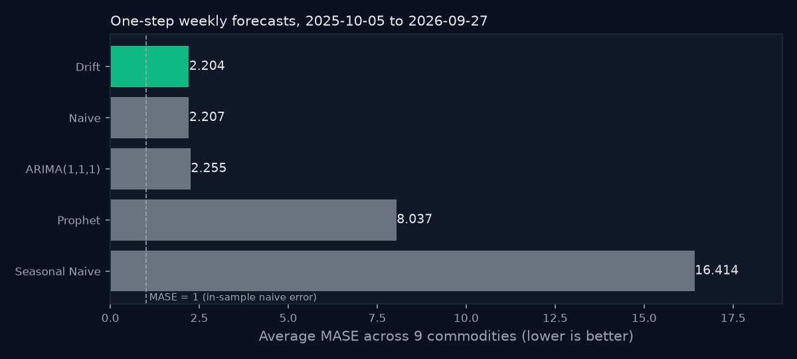
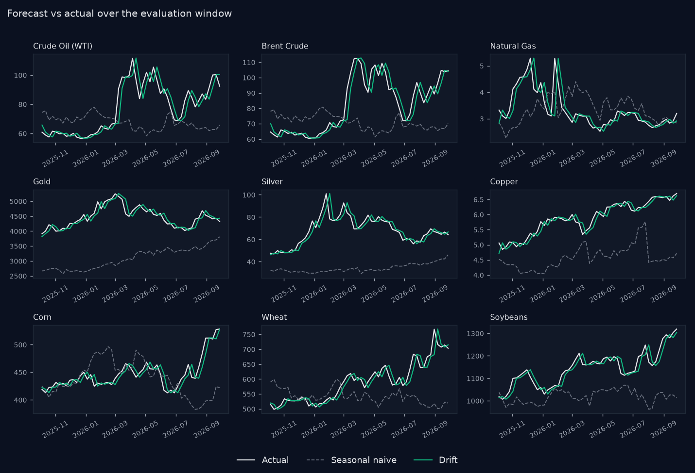
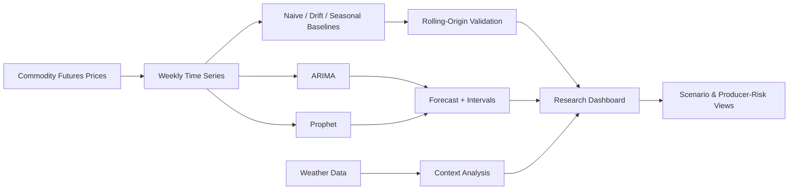
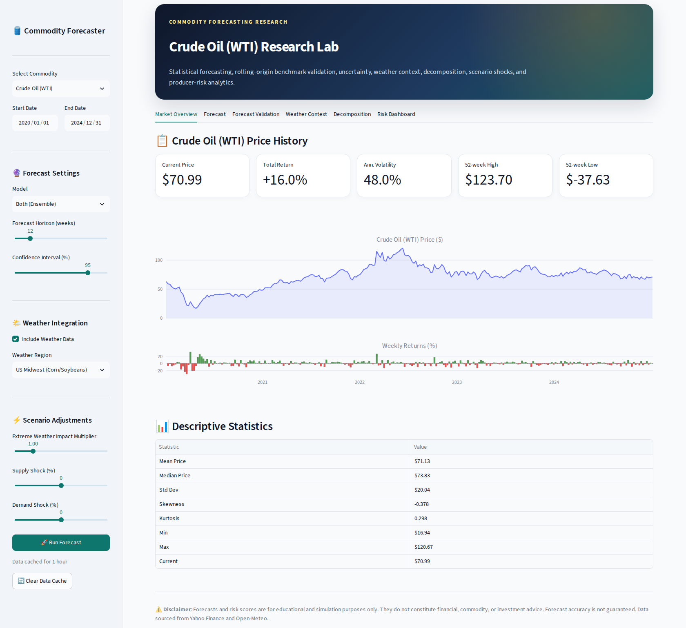
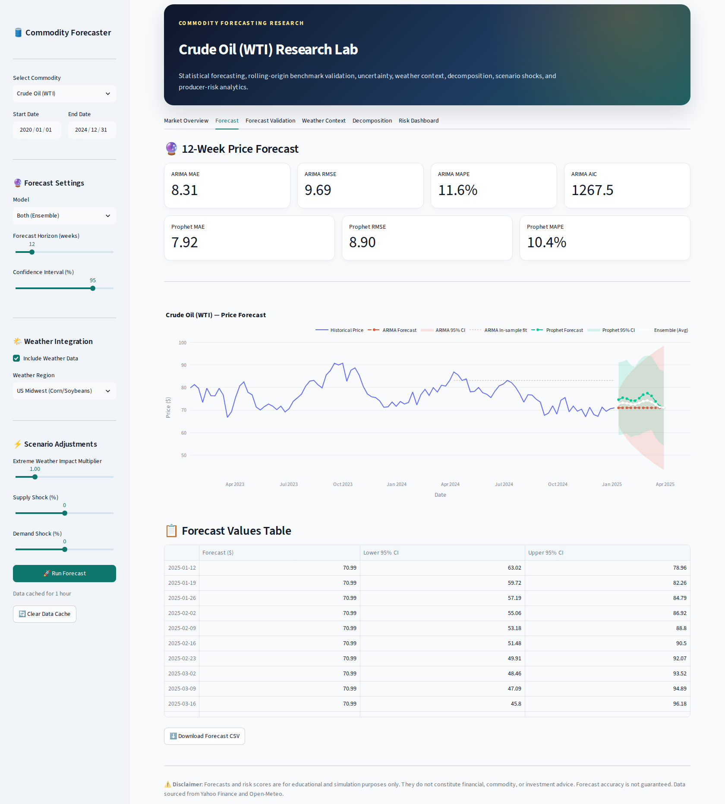
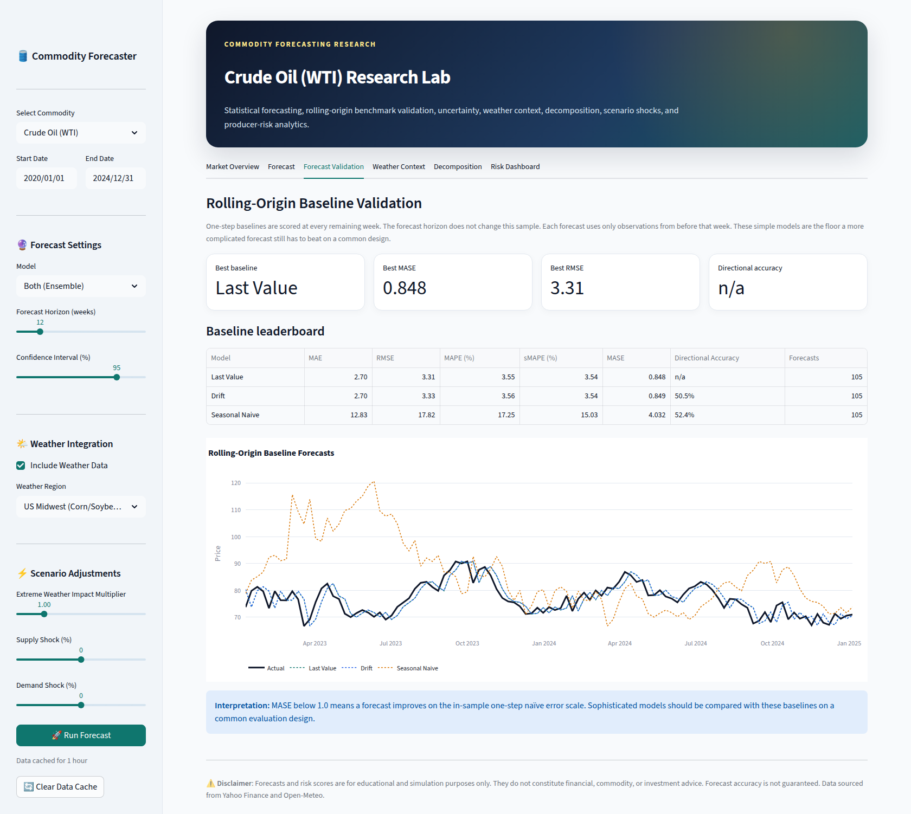
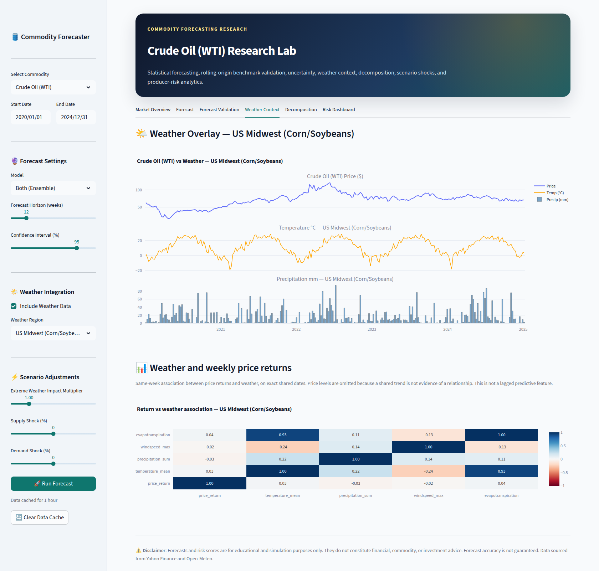
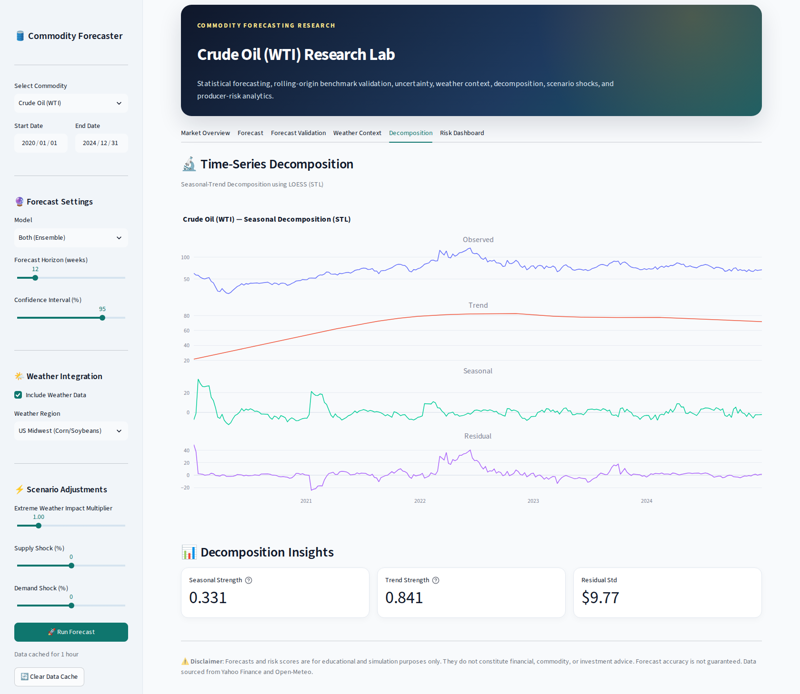
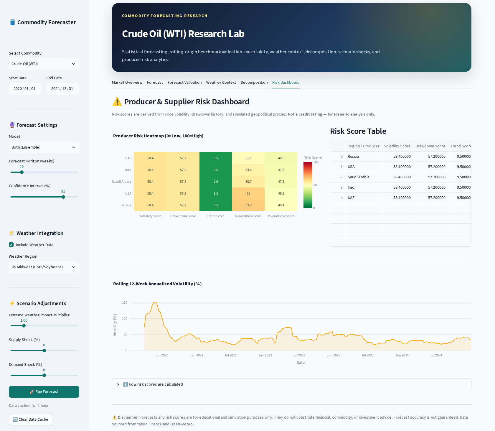

# Commodity Forecasting Research Lab

[](requirements.txt)
[](app.py)
[](src/validation.py)
[](src/forecaster.py)
[](https://github.com/ParBproject/commodity-price-forecaster/actions/workflows/python-package-conda.yml)

**[Live demo →](https://parbproject.github.io/commodity-price-forecaster/)** interactive walk-forward leaderboard and forecast-vs-actual charts, built from the committed results file.

A decision-oriented time-series forecasting project for **energy, metals, and agricultural commodities** using real market prices, statistical forecasting, rolling-origin benchmark validation, uncertainty intervals, weather context, decomposition, and scenario analysis.

It is written for quantitative and data-analyst review: time-series modeling, benchmark design, out-of-sample evaluation, external-data integration, risk communication, visualization, and reproducible testing. Point forecasts are shown with uncertainty intervals and seasonal decomposition, so the result is a range and a structure rather than a single promised price.

## Results

<!-- results:start (generated by scripts/run_leaderboard.py) -->

**Evaluation window:** 52 weekly one-step forecasts from 2025-10-05 to 2026-09-27 (training history from 2016-01-10), across 9 futures. Data: Yahoo Finance via yfinance daily closes, snapshot `data/commodity_prices_daily_2026-09-30.csv` taken 2026-09-30.

**Winner: Drift**, average MASE 2.204 versus 16.414 for seasonal naive, 14.209 lower (86.57% better). A simple baseline won. Its lead over Naive is 0.0029 MASE, so the two baselines are effectively tied, and ARIMA(1,1,1) and Prophet did not beat it on average at a one-week horizon.

| Rank | Model | Avg MASE | Avg sMAPE (%) | Avg MAE |
|---:|---|---:|---:|---:|
| 1 | **Drift** | 2.204 | 4.00 | 20.21 |
| 2 | Naive | 2.207 | 4.01 | 20.30 |
| 3 | ARIMA(1,1,1) | 2.255 | 4.05 | 20.80 |
| 4 | Prophet | 8.037 | 14.58 | 86.05 |
| 5 | Seasonal Naive | 16.414 | 25.38 | 187.87 |

MASE by commodity (lower is better, best in **bold**):

| Commodity | Drift | Naive | ARIMA(1,1,1) | Prophet | Seasonal naive |
|---|---:|---:|---:|---:|---:|
| Crude Oil (WTI) (`CL=F`) | 2.035 | 2.036 | **2.033** | 5.873 | 7.863 |
| Brent Crude (`BZ=F`) | **1.960** | 1.961 | 1.976 | 6.292 | 8.335 |
| Natural Gas (`NG=F`) | 1.335 | **1.334** | 1.336 | 3.285 | 3.422 |
| Gold (`GC=F`) | **4.219** | 4.240 | 4.366 | 16.527 | 48.443 |
| Silver (`SI=F`) | 6.356 | **6.347** | 6.635 | 22.971 | 52.766 |
| Copper (`HG=F`) | 1.436 | 1.442 | **1.417** | 4.801 | 15.138 |
| Corn (`ZC=F`) | 0.741 | 0.743 | **0.738** | 2.770 | 2.705 |
| Wheat (`ZW=F`) | 0.897 | 0.898 | **0.891** | 3.280 | 3.886 |
| Soybeans (`ZS=F`) | **0.857** | 0.863 | 0.903 | 6.532 | 5.164 |





MASE is scaled by the in-sample mean absolute weekly change before the first origin. Values above 1 mean the evaluation year moved more than the training history did (gold and silver especially), not that the models broke. Seasonal naive repeats the price from 52 weeks earlier, which is a poor guide for trending futures prices.

Reproduce: `python scripts/run_leaderboard.py` (about a minute; Prophet is included when installed). The numbers are pinned by `tests/test_leaderboard.py::test_committed_leaderboard_headline_numbers` and recomputed from the snapshot by `tests/test_leaderboard.py::test_baselines_and_arima_recompute_from_snapshot`.

<!-- results:end -->

## Employer snapshot

| Capability | Evidence |
|---|---|
| Real financial data | Commodity futures histories via Yahoo Finance |
| Forecasting | Auto-ARIMA (seasonal only when the sample is long enough) and Prophet. No exogenous regressors. |
| Baselines | Last-value, drift, and seasonal-naïve forecasts |
| Validation | Rolling-origin one-step evaluation with no future leakage |
| Forecast metrics | MAE, RMSE, MAPE, sMAPE, MASE, directional accuracy |
| Seasonality | Weekly resampling and STL decomposition |
| External context | Open-Meteo weather data for producing regions |
| Scenario analysis | Explicit supply, demand, and weather multipliers |
| Risk communication | Uncertainty intervals and an illustrative producer-risk view |
| Engineering | Modular Python, tests, CI on Python 3.10/3.12 |
| Reporting | Professional Streamlit research dashboard |

## Research question

The project is not framed as “which model produces the prettiest future line?”

It asks:

1. What is the historical behavior of the commodity?
2. What trend and seasonal structure is visible?
3. How does a sophisticated model compare with **transparent naïve baselines**?
4. How stable is forecast error across rolling future observations?
5. How large is forecast uncertainty?
6. How should weather or supply/demand assumptions be presented without confusing scenario sensitivity with causality?

## Forecasting workflow

### Forecasting architecture


```mermaid
flowchart LR
    A[Commodity Futures Prices] --> B[Weekly Time Series]
    B --> C[Naive / Drift / Seasonal Baselines]
    B --> D[ARIMA]
    B --> E[Prophet]
    C --> F[Rolling-Origin Validation]
    D --> G[Forecast + Intervals]
    E --> G
    H[Weather Data] --> I[Context Analysis]
    F --> J[Research Dashboard]
    G --> J
    I --> J
    J --> K[Scenario & Producer-Risk Views]
```


```text
Historical commodity futures prices
        ↓
Weekly resampling
        ↓
Trend / return / volatility analysis
        ↓
Rolling-origin baseline validation
        ↓
ARIMA / Prophet estimation
        ↓
Forecast + uncertainty interval
        ↓
Benchmark interpretation
        ↓
Weather context + decomposition
        ↓
Scenario sensitivity + producer risk
```

## Rolling-origin benchmark validation

A complex forecasting model should clear a simple benchmark before its results are treated as meaningful.

The new validation layer in `src/validation.py` evaluates three baselines:

**Last Value**

```text
Forecast[t+1] = Actual[t]
```

**Drift**

Extends the average historical movement between the first and latest training observation.

**Seasonal Naïve**

Repeats the observation from the prior seasonal cycle when enough history exists. For weekly commodity data, the default seasonal cycle is **52 weeks**.

For each rolling forecast origin, only observations strictly before the forecast date are available to the benchmark.

## Forecast metrics

The benchmark leaderboard reports:

- **MAE** — average absolute error in commodity-price units;
- **RMSE** — penalizes larger forecast misses;
- **MAPE** — percentage error where actual prices are non-zero;
- **sMAPE** — symmetric percentage error;
- **MASE** — error scaled by the in-sample one-step naïve error;
- **Directional Accuracy** — whether the predicted and realized weekly moves share the same sign. A flat forecast never calls a direction, so its directional accuracy is reported as n/a.

The Forecast tab score is a different experiment from this leaderboard. It is one multi-step forecast from a single origin at 85% of the sample. The model is then refit on the full sample for the path that is plotted. Those two numbers should not be compared as if they came from the same design.

A particularly useful interpretation is:

```text
MASE < 1 → better than the in-sample naïve error scale
MASE > 1 → worse than the naïve error scale
```

## Professional dashboard

The Streamlit application is organized into six workbenches:

**Market Overview**  
Price history, returns, volatility, range, and descriptive statistics.

**Forecast**  
ARIMA, Prophet, or ensemble forecasts with confidence intervals and exportable values.

**Forecast Validation**  
Rolling-origin baseline leaderboard, prediction traces, MASE, RMSE, and directional accuracy.

**Weather Context**  
Regional weather overlays and weather-price correlation diagnostics.

**Decomposition**  
Trend and seasonal structure through STL decomposition.

**Risk Dashboard**  
Producer/supplier risk scoring and scenario-oriented interpretation.

## Dashboard preview

These previews are the current Streamlit app on its default view: WTI crude oil, January 2020 through December 2024, US Midwest weather, and the ARIMA + Prophet ensemble.

### Market overview



### Forecast comparison



### Forecast validation



### Weather context



### Decomposition



### Risk dashboard



## Supported markets

| Category | Examples |
|---|---|
| Energy | WTI crude oil, Brent crude, natural gas |
| Metals | Gold, silver, copper |
| Agriculture | Corn, wheat, soybeans |

## Weather integration

Weather data is obtained through the Open-Meteo historical API for selected producing regions.

The application can contextualize price history with variables including:

- average temperature;
- precipitation;
- maximum wind speed;
- evapotranspiration.

The dashboard associates **weekly price returns** with same-week weather on exact shared dates. Price levels are not correlated, because a shared trend is not a relationship. The result is descriptive context. It is **not** a lagged model feature and it is **not** evidence of causality.

## Scenario analysis

The dashboard exposes explicit controls for:

- supply shock;
- demand shock;
- weather-impact multiplier.

These are sensitivity-analysis assumptions rather than estimated event probabilities. They scale the published forecast path after the model is fit. They do not rewrite history, and they do not enter the holdout score.

Keeping scenario assumptions visible prevents the output from appearing more certain than the underlying model.

## Repository architecture

```text
commodity-price-forecaster/
├── app.py
├── src/
│   ├── data_loader.py
│   ├── forecaster.py
│   ├── validation.py
│   ├── benchmark.py          # multi-commodity walk-forward leaderboard
│   └── utils.py
├── scripts/
│   ├── download_snapshot.py  # one-off Yahoo Finance snapshot
│   └── run_leaderboard.py    # writes results/, charts and README Results
├── data/                     # dated daily price snapshot + metadata
├── results/                  # leaderboard.json and PNG charts
├── site/                     # static live demo (GitHub Pages)
├── tests/
│   ├── test_forecaster.py
│   ├── test_leaderboard.py
│   └── test_validation.py
├── notebooks/
│   └── 01_model_development.ipynb
├── assets/screenshots/
├── .streamlit/config.toml
├── .github/workflows/
├── FORECASTING_METHODOLOGY.md
├── requirements.txt
└── README.md
```

## Run locally

```bash
git clone https://github.com/ParBproject/commodity-price-forecaster.git
cd commodity-price-forecaster

python -m venv .venv
source .venv/bin/activate

python -m pip install -r requirements.txt -r requirements-dev.txt
streamlit run app.py
```

Run tests:

```bash
python -m pytest -q
```

## Validation and reproducibility

Automated tests cover:

- forecast metric calculations;
- empty and mismatched inputs;
- Prophet component handling when seasonalities are disabled;
- last-value benchmark behavior;
- drift forecasts using only training endpoints;
- seasonal-naïve cycle alignment;
- MASE scaling;
- rolling-origin chronology;
- bounded directional accuracy;
- pinned rolling-origin errors and a check that each score uses only its training prefix;
- a trailing 52-week high and low, separate from the full-sample range;
- causal forecast features and lagged weather;
- Hyndman seasonal and trend strength;
- an ARIMA(1, 1, 1) holdout that is scored before the full-sample refit;
- the committed leaderboard headline numbers, a recomputation of the baselines and ARIMA from the committed snapshot, a Prophet recomputation that skips when Prophet is not installed, and a check that the README Results block matches `results/leaderboard.json`.

GitHub Actions runs linting, source compilation, the regression suite, and validation-module import checks on Python **3.10 and 3.12**. A second workflow (`.github/workflows/pages.yml`) publishes `site/` plus `results/leaderboard.json` to GitHub Pages on every push to `main`.

## Skills demonstrated

**Time-series analytics:** ARIMA, Prophet, decomposition, seasonality, rolling-origin validation.

**Data analysis:** pandas, NumPy, descriptive statistics, error metrics, weather integration, correlation analysis.

**Forecast governance:** benchmark comparison, uncertainty communication, MASE, chronological evaluation, explicit scenario assumptions.

**Software engineering:** modular Python, automated tests, CI/CD, cached external data, defensive validation.

**Business communication:** dashboard design, forecast tables, uncertainty intervals, scenario summaries, producer-risk interpretation.

## Methodology

See **[FORECASTING_METHODOLOGY.md](FORECASTING_METHODOLOGY.md)** for benchmark definitions, evaluation metrics, rolling-origin design, model assumptions, and production limitations.

## Limitations

- Commodity futures can contain contract-roll effects.
- Historical relationships can change across market regimes.
- Forecast intervals depend on model assumptions and data quality.
- Weather relevance differs by commodity and region.
- Correlation is not causation.
- Scenario multipliers are sensitivity assumptions, not estimated event probabilities.
- Repeated tuning against a fixed holdout can overfit the evaluation process.

## Roadmap

- rolling-origin evaluation for each fitted ARIMA / Prophet candidate;
- forecast calibration and interval-coverage diagnostics;
- inventory, term-structure, FX, rates, and production fundamentals;
- downloadable validation reports;
- hosted dashboard deployment.

## Responsible use

Educational forecasting and analytics project only. Forecasts and scenarios are uncertain and do not constitute trading, hedging, or investment advice.
